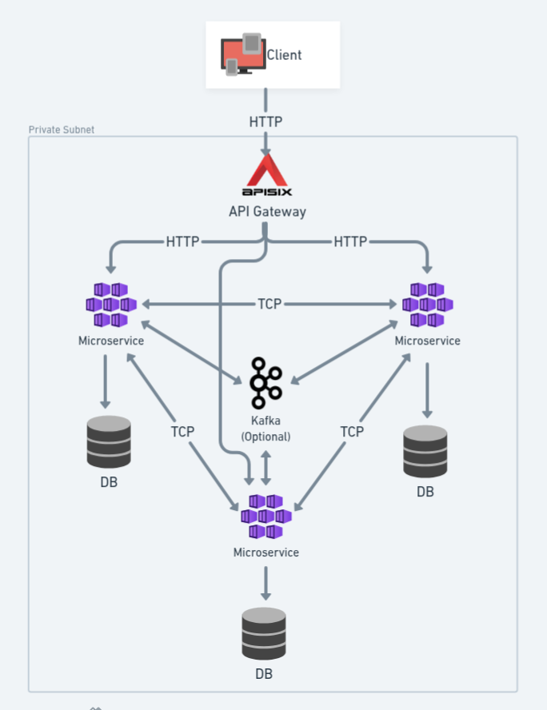

# 🧠 Nest Turbo Starter

A high-performance, monorepo microservices platform built with NestJS, optimized for speed using Turborepo and the pnpm package manager. The system is containerized with Docker and features dynamic traffic management and security via API Gateway (Apache APISIX / Kong).

# 📑 Table of Contents

* [🚀 Getting Started](#-getting-started)
* [🏗️ System Architecture](#-system-architecture)
* [📦 Monorepo Structure](#-monorepo-structure)
* [✅ Tech Stacks](#-tech-stacks)
* [🛠️ Installation Preparation](#-installation-preparation)
* [🐳 Build with Docker](#build-with-docker-)
  * [Setup Docker](#setup-docker)
  * [Install Dependencies](#install-dependencies)
  * [Build Services](#build-services)
  * [Run Database Migrations](#run-database-migrations)
  * [Start Microservices](#start-microservices)
* [🧑‍💻 Manual Build](#-manual-build)
  * [Prerequisites](#prerequisites)
  * [Environment Setup](#environment-setup)
  * [Install Dependencies](#install-dependencies-1)
  * [Build](#build)
  * [Run Database Migrations](#run-database-migrations-1)
  * [Start Microservices](#start-microservices-1)
* [🌐 API Gateway Configuration](#-api-gateway-configuration)
  * [Apache APISIX (Default Gateway)](#apache-apisix-default-gateway)
  * [Kong Gateway (Alternative Option)](#kong-gateway-alternative-option)
* [🌍 Access URLs](#-access-urls)
  * [🧭 API Gateways](#-api-gateways)
  * [⚙️ Microservices](#-microservices)
  * [🧰 Tools & Management UI](#-tools--management-ui)
* [🔐 Demo API — Sign-Up & Login (cURL)](#-demo-api--sign-up--login-curl)
  * [Sign-Up](#sign-up)
  * [Login](#login)
* [📘 Notes](#-notes)

# 🚀 Getting Started

## ✨ Key Concepts (Monorepo & Performance)
This starter uses a Monorepo structure managed by **Turborepo** and **pnpm** to maximize performance and simplify development across multiple microservices.

---

## 🏗️ System Architecture

<p align="center">
  
</p>

This project implements a robust, containerized microservices architecture designed for high availability and scalability. All core services-built on NestJS and Node.js-reside within a secure Private Subnet, adhering to the principle of service autonomy where each microservice owns its PostgreSQL database. External client requests are strictly managed by Apache APISIX, which serves as the central API Gateway for routing, security, and policy enforcement via HTTP. Internal service-to-service communication is handled via efficient TCP connections, while Kafka is optionally integrated to enable scalable, asynchronous communication and event-driven processing, minimizing service coupling.

---

## 📦 Monorepo Structure
```bash
  apps/
    auth-service/
    user-service/
    ...
  libs/
    common/
    core/
    ...
  config/
    apisix/
    kong/
```
---

## ✅ Tech Stacks

### 🚀 Core Backend
| Component        | Version | Description                           |
|------------------|---------|---------------------------------------|
| Node.js          | 22.15   | JavaScript runtime                    |
| NestJS           | 11      | Backend framework                     |
| TypeScript       | 5.x     | Type-safe language                    |
| PostgreSQL       | 16      | Main relational DB                    |
| MikroORM         | 6.x     | ORM                                   |
| Redis            | 8.0     | Cache & queue backend                 |
| pnpm             | 10.x    | Monorepo package manager              |
| Kafka (optional) | 4.x     | Event streaming & async communication |


### 🌐 API Gateway & Service Mesh
| Component | Version | Description |
|------------|----------|-------------|
| Apache APISIX | 3.14 | Default API Gateway |
| Etcd | 3.5.1 | APISIX config store |
| Kong | 3.12 | Optional alternative gateway |

### Infrastructure & DevOps
| Component | Version | Description |
|------------|----------|-------------|
| Docker / Compose | latest | Containerization |
| ADC | latest | APISIX config sync |
| deck | latest | Kong config sync |
| Redis Insight | latest | Redis visualization |
| Kafka UI | latest | Kafka management UI |
| Kong Manager | 3.12 | Kong dashboard |

### 🧰 Developer Tools
| Tool | Description |
|------|--------------|
| ESLint / Prettier | Linting & formatting |
| Jest | Unit testing |
| Swagger | API documentation |
| Husky + lint-staged | Git pre-commit checks |
| Dotenv | Env management |
---

## 🛠️  Installation Preparation

1. **Default Base Path**

   ```bash
   /home/app.user/nest-turbo-starter
   ```

2. **Environment Variables**

   Copy the sample environment file:

  ```bash
  cp .env.example .env
  ```

  ```bash
  cd apps/service_name & cp .env.example .env
  ```
> ⚠️ **Note:**
> - The project require additional environment variables both at the **root** of the monorepo/turborepo and for each individual microservice
> - Make sure to add these variables of **root** to turbo.json (or your monorepo configuration)
---

# Build with Docker 🐳

### Setup Docker

Build and start all containers:

```bash
docker compose up -d --build
```

---

### Install Dependencies

Install dependencies inside the Node container:

```bash
docker compose exec node pnpm install
```

---

### Build Services

#### Build all services

  ```bash
  docker compose exec node pnpm build
  #or
  make buildApp
  ```

#### Build a single service

  ```bash
  docker compose exec node pnpm --filter=service_name build
  #or
  make buildApp filter=service_name
  ```

---

### Run Database Migrations

#### Create migration file

  ```bash
  # Generate a migration script based on entities (recommended)
  docker compose exec node pnpm --filter=service_name migration:create --name migration_name
  # Create blank file
  docker compose exec node pnpm --filter=service_name migration:createBlank --name migration_name 
    
  ```

#### Run migrations for all services

  ```bash
  docker compose exec node pnpm migrate
  #or
  make migrate
  ```

#### Run migrations for a specific service

  ```bash
  docker compose exec node pnpm --filter=service_name migration:up
  #or
  make migrate filter=service_name
  
  # Example:
  docker compose exec node pnpm --filter=user-service migration:up
  make migrate filter=user-service
  ```

---

### Start Microservices

#### 🧩 Development Mode

* Start all services:

  ```bash
  docker compose exec node pnpm dev
  #or
  make dev
  ```

* Start a single service:

  ```bash
  docker compose exec node pnpm dev --filter=service_name
  #or
  make dev filter=service_name
  
  # Example:
  docker compose exec node pnpm dev --filter=auth-service
  make dev filter=auth-service
  ```

#### 🚀 Production Mode

* Start all services:

  ```bash
  docker compose exec node pnpm prod
  #or
  make prod
  ```

* Start a single service:

  ```bash
  docker compose exec node pnpm prod --filter=service_name
  #or
  make prod filter=service_name
  ```

---

# 🧑‍💻 Manual Build

If you prefer to run the Node application **without Docker**, follow these steps.

---

### Prerequisites

#### Create Only Required Docker Containers

If you want to run microservices **manually** while still using Docker for dependencies (e.g., database, Redis, API gateway), you can start only the required containers.

#### Option 1 — Using `docker-compose-dev.yml`

Start all necessary infrastructure containers (e.g., PostgreSQL, Redis, APISIX):

```bash
docker compose -f docker-compose-dev.yml up -d --build
```

#### Option 2 — Start Specific Containers

You can also start individual containers as needed:

```bash
docker compose up -d db
docker compose up -d redis
docker compose up -d apisix
```

> 💡 **Tip:** This approach is ideal for local development when running Node.js services directly on your host machine instead of inside Docker.


#### `pnpm` installed globally:
  ```bash
  npm install -g pnpm
  ```

---

### Environment Setup

Copy and configure environment variables:

```bash
cp .env.example .env
```

Edit `.env` with correct values for database, Redis, Kafka, and gateway settings.

---

### Install Dependencies

Install all workspace dependencies:

```bash
pnpm install
```

Or install only for a single service:

```bash
pnpm --filter=auth-service install
```

---

### Build

Build all microservices:

```bash
pnpm build
```

Or build one specific service:

```bash
pnpm --filter=auth-service build
```

---

### Run Database Migrations

Run migrations for all services:

```bash
pnpm migration:up
```

Or for one service:

```bash
pnpm --filter=auth-service migration:up
```

---

### Start Microservices

#### Development mode

Start all services:

```bash
pnpm dev
```

Start one specific service:

```bash
pnpm dev --filter=auth-service
```

#### Production mode

Start all services:

```bash
pnpm prod
```

Start one specific service:

```bash
pnpm prod --filter=auth-service
```

---

## 🌐 API Gateway Configuration

> ⚠️ **Note:**
> - The current setup uses **Kong Gateway (Free / OSS Edition)**, which lacks several advanced enterprise features such as rate limiting, JWT key rotation, analytics, and RBAC management.
> - To address these limitations and support more advanced features, **Apache APISIX** is chosen as the **default API gateway** for this system.  
> - Key reasons include:
>   - Free & open source
>   - High performance and low latency
>   - Easy integration with etcd for declarative configuration
>   - Rich plugin ecosystem (rate limiting, JWT auth, logging, etc.)
>   - Active community and rapid development
> - The system is currently under active development to integrate and extend these features.

### Apache APISIX (Default Gateway)

#### Sync configuration from file

```bash
docker compose run --rm adc adc sync -f conf/apisix-${environment}.yaml
# Example:
docker compose run --rm adc adc sync -f conf/apisix-dev.yaml
```

#### Dump configuration from DB for verification

```bash
docker compose run --rm adc adc dump -o adc/adc.yaml
```

---

### Kong Gateway (Alternative Option)

Sync configuration using `deck`:

```bash
docker compose run --rm kong-deck gateway sync /app/kong-dev.yaml
```

---

# 🌍 Access URLs

## 🧭 API Gateways

| Gateway          | URL Example                                                                    |
|------------------| ------------------------------------------------------------------------------ |
| **APISIX Node**  | [http://localhost:`APISIX_NODE_LISTEN`](http://localhost:`APISIX_NODE_LISTEN`) |
| **Kong Gateway** | http://localhost:18088 |

---

## ⚙️ Microservices

| Type             | Example                                                                                  |
|------------------|------------------------------------------------------------------------------------------|
| **Direct Access** | http://localhost:port/api                                                                |
| **Via APISIX**   | http://localhost:`APISIX_NODE_LISTEN`/`service_name`/api                                 |
| Example          | [http://localhost:9080/auth-service/api](http://localhost:9080/auth-service/api)         |
| Swagger          | [http://localhost:9080/auth-service/swagger](http://localhost:9080/auth-service/swagger) |

---

## 🧰 Tools & Management UI

| Tool          | URL                                              |
| ------------- | ------------------------------------------------ |
| Redis Insight | [http://localhost:5534](http://localhost:5534)   |
| Kafka UI      | [http://localhost:18082](http://localhost:18082) |
| Kong Manager  | [http://localhost:18086](http://localhost:18086) |
| APISIX Dashboard| http://localhost:`APISIX_DEPLOYMENT_ADMIN_LISTEN`/ui |


---
# 🔐 Demo API — Sign-Up & Login (cURL)

## Sign-Up
```bash
    curl --location --request POST 'http://0.0.0.0:9080/auth-service/api/auth/sign-up' \
    --header 'Content-Type: application/json' \
    --data-raw '{
        "email": "test@example.com",
        "password": "12345678Aa@"
    }'
```
## Login
```bash
    curl --location --request POST 'http://0.0.0.0:9080/auth-service/api/auth/login' \
    --header 'Content-Type: application/json' \
    --data-raw '{
        "email": "test@example.com",
        "password": "12345678Aa@"
    }'
```
---

# 📘 Notes

* Make sure `.env` and configuration files (`apisix-*.yaml`, `kong-*.yaml`) are properly set before running migrations or gateway sync commands.
* Use `pnpm --filter=<service>` to target specific microservices efficiently.
* If using Docker, ensure Docker and Docker Compose are running before executing commands.
---

**© Nest Turbo Starter — Monorepo, Microservice Backend System**
